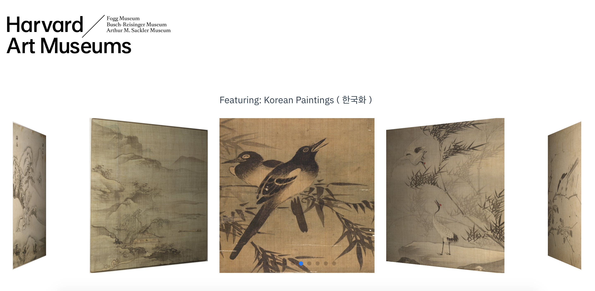
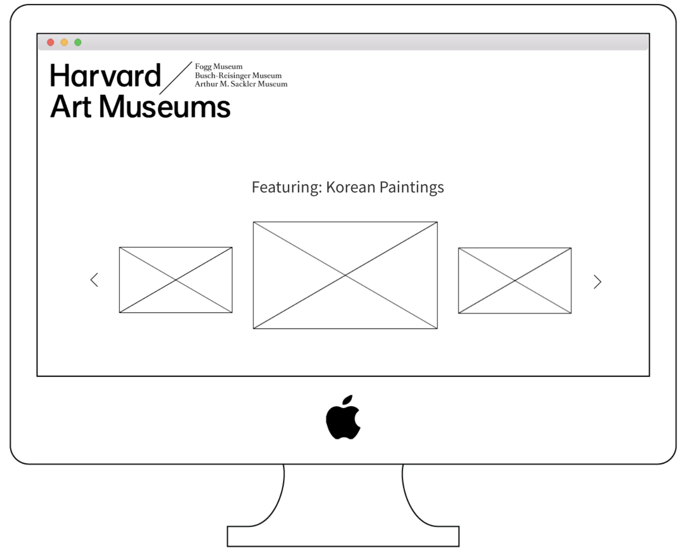

# Harvard Art Project - Korean Paintings Edition

Harvard Art Project - Korean Paintings Edition was created to showcase as well as promote certain selections of Korean art. The carousel allows users to easily swipe through the paintings one by one while viewing the associated title and info. One major learning goal of this project was to expand outside of React, and become more familiar with Vue.

### Website Link:
[Harvard Art Project - Korean Paintings Edition](http://harvard-art-project.s3-website-us-west-2.amazonaws.com/)

### Preview:

### Wireframes:

### Set-Up:
**Front end**  
Clone this repo  
Run `npm install` from the root directory  
Run `npm run serve` and visit http://localhost:8080

**Back end**   
[Harvard Art Museum API](https://www.harvardartmuseums.org/collections/api)

### Primary Technologies Used:
* Vue
* Amazon Web Services - S3

### Original Assignment: 
[Final Countdown](http://frontend.turing.io/projects/final-countdown.html) project from Turing School of Software and Design  

